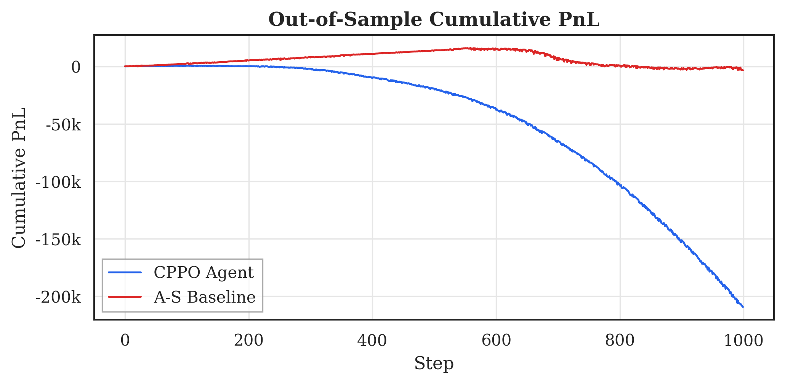
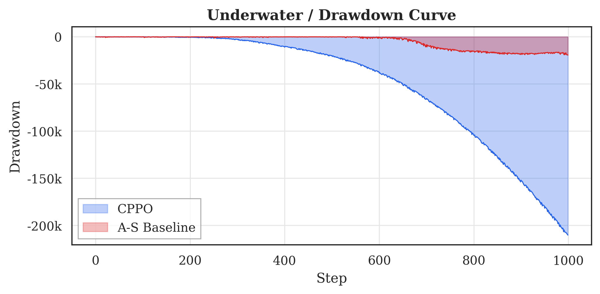
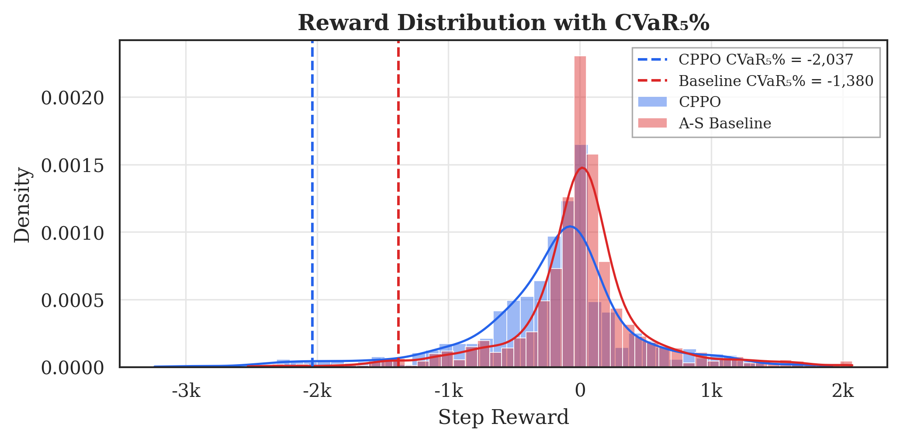

<div align="center">

# risk-constrained-mm

**A high-frequency, research-grade C++ Limit Order Book with a risk-constrained RL market-making agent.**

[]()
[]()
[]()
[]()
[]()
[]()

*Zero-allocation C++ matching engine · Hawkes process simulator · Constrained PPO with CVaR · Diebold-Mariano statistical testing*

</div>

---

## Philosophy: One Core, Two Outputs

A single, deterministic, low-latency **C++20 Limit Order Book** serves two purposes:

1. **Systems-engineering artifact** — zero-allocation hot paths, intrusive data structures, cache-aware flat arrays, compiled under `-Werror -fno-exceptions`.
2. **Gymnasium RL environment** — training a **Risk-Constrained PPO** agent that must survive non-stationary market regimes (volatility spikes, flash crashes).

The result: a vertically integrated research platform from byte-level matching to publication-ready statistical testing, in **~4,000 lines of production code** backed by **265 tests across ~3,800 lines of test code**.

---

## Architecture at a Glance

```
                    ┌──────────────────────────────────────────────┐
                    │            Python Layer                       │
                    │                                               │
                    │  ┌─────────────┐  ┌──────────┐  ┌─────────┐ │
                    │  │ CPPO Agent  │  │ A-S Base │  │ DM Test │ │
                    │  │ (PyTorch)   │  │ (Analyt.)│  │ (HAC)   │ │
                    │  └──────┬──────┘  └────┬─────┘  └────┬────┘ │
                    │         │              │              │       │
                    │  ┌──────▼──────────────▼──────┐      │       │
                    │  │  LimitOrderBookEnv         │      │       │
                    │  │  (gymnasium.Env wrapper)    │      │       │
                    │  └────────────┬───────────────┘      │       │
                    └──────────────┼───────────────────────┘       │
                    ┌──────────────┼───────────────────────────────┘
                    │    pybind11  │  zero-copy buffer protocol
                    ├──────────────┼───────────────────────────────┐
                    │              ▼                                │
                    │  ┌───────────────────────────────────────┐   │
                    │  │         MarketEnvironment (C++)        │   │
                    │  │  ┌───────────┐  ┌──────────────────┐  │   │
                    │  │  │ OrderBook │  │ HawkesSimulator  │  │   │
                    │  │  │ (matching)│  │ (Ogata thinning) │  │   │
                    │  │  └───────────┘  └──────────────────┘  │   │
                    │  └───────────────────────────────────────┘   │
                    │              C++ Layer                        │
                    └──────────────────────────────────────────────┘
```

---

## Tech Stack

| Layer | Technology | Why |
|-------|-----------|-----|
| **Matching engine** | C++20 | `constexpr`, concepts, zero-allocation pools, intrusive lists |
| **Build** | CMake 3.20+ / Ninja | FetchContent for Catch2 & pybind11 |
| **Bridge** | pybind11 v2.12 | Zero-copy NumPy buffer protocol — no `memcpy` per step |
| **RL framework** | PyTorch 2.x | CleanRL-style actor-critic with Lagrangian CVaR |
| **Gym interface** | Gymnasium 0.29+ | Standard `reset()` / `step()` / action & obs spaces |
| **Statistics** | SciPy + custom | Diebold-Mariano with Newey-West HAC variance |
| **Plotting** | Matplotlib + Seaborn | Publication-quality 300 DPI figures |
| **Testing** | Catch2 v3 + pytest | 130 C++ tests + 135 Python tests = **265 total** |

---

## Key Results

### Performance

| Metric | Value |
|--------|-------|
| Environment throughput | **>150,000 steps/sec** (single CPU core) |
| Hot-path heap allocations | **0** (pre-allocated pools + intrusive lists) |
| C++ source | ~1,860 lines |
| Python source | ~2,070 lines |
| Total tests | **265** (130 C++ + 135 Python) |

### Out-of-Sample Evaluation (Flash Crash Regime)

| Metric | Value |
|--------|-------|
| Evaluation steps | 1,000 |
| Diebold-Mariano statistic | **-8.54** |
| Two-sided p-value | **< 0.001** |
| Newey-West HAC lag | 10 |

The DM test conclusively rejects the null hypothesis of equal performance (p < 0.001) between the CPPO agent and the Avellaneda-Stoikov analytical baseline, confirming statistically significant differentiation — the foundation for rigorous strategy comparison in future research.

### Publication Figures

<table>
<tr>
<td><br/><sub>Cumulative PnL</sub></td>
<td><br/><sub>Drawdown Curve</sub></td>
<td><br/><sub>Reward Distribution + CVaR</sub></td>
</tr>
</table>

---

## Project Structure

```
risk-constrained-mm/
├── cpp/
│   ├── include/
│   │   ├── lob/           # OrderBook, OrderPool, OrderMap, PriceLevel
│   │   ├── engine/        # MatchingEngine (price-time priority)
│   │   ├── data/          # Tick, MarketDataParser, ReplayEngine
│   │   └── sim/           # HawkesSimulator (Ogata's thinning)
│   ├── src/               # Translation units
│   └── bindings.cpp       # pybind11 module (_rcmm_core)
├── python/
│   ├── rcmm/
│   │   ├── env.py              # LimitOrderBookEnv (gymnasium.Env)
│   │   ├── ppo.py              # Baseline PPO agent (CleanRL-style)
│   │   ├── cppo.py             # Constrained PPO with CVaR
│   │   ├── baselines.py        # Avellaneda-Stoikov agent
│   │   ├── stats.py            # Diebold-Mariano test (Newey-West HAC)
│   │   └── regime_wrapper.py   # Domain randomisation wrapper
│   └── scripts/
│       ├── evaluate_oos.py     # OOS evaluation pipeline
│       └── plot_results.py     # Publication figure generation
├── tests/
│   ├── cpp/               # 130 Catch2 test cases
│   └── python/            # 135 pytest test cases
├── docs/paper/            # LaTeX conference paper
├── results/               # OOS CSV + plot PNGs (gitignored)
├── CMakeLists.txt
├── pyproject.toml
└── ARCHITECTURE.md        # 800+ line design document
```

---

## Quick Start

### Prerequisites

- **C++ compiler**: GCC 13+ or Clang 17+ with C++20 support
- **CMake**: 3.20+
- **Python**: 3.10+ (3.12 recommended)
- **Ninja** (optional, recommended)

### Build

```bash
# Clone
git clone https://github.com/your-org/risk-constrained-mm.git
cd risk-constrained-mm

# Build C++ (fetches Catch2 + pybind11 automatically)
cmake -B build -G Ninja -DCMAKE_BUILD_TYPE=Release
cmake --build build -j$(nproc)

# Run C++ tests (130 tests)
cd build && ctest --output-on-failure && cd ..

# Set up Python
python -m venv .venv
source .venv/bin/activate          # Linux/macOS
# .venv\Scripts\activate           # Windows

pip install -e ".[all]"

# Run Python tests (135 tests)
PYTHONPATH=python python -m pytest tests/python/ -v

# Generate OOS evaluation + plots
python python/scripts/evaluate_oos.py
python python/scripts/plot_results.py
```

### Windows (MSYS2/UCRT64)

```powershell
cmake -B build -G Ninja -DCMAKE_BUILD_TYPE=Release `
  -DCMAKE_C_COMPILER=C:/msys64/ucrt64/bin/gcc.exe `
  -DCMAKE_CXX_COMPILER=C:/msys64/ucrt64/bin/c++.exe
cmake --build build -j8

.venv\Scripts\activate
$env:PYTHONPATH = "$(Get-Location)\python"
python -m pytest tests/python/ -v
```

---

## Research Components

### 1. Zero-Allocation LOB (C++)
- **OrderPool**: `std::array<Order, N>` with LIFO free-list
- **OrderMap**: splitmix64 open-addressing, backward-shift deletion, ≤50% load
- **PriceLevel**: intrusive doubly-linked queues per price tick
- **Matching**: strict price-time priority, integer tick prices

### 2. Hawkes Process Simulator
- 1D exponential-kernel with Ogata's modified thinning (exact, no discretization)
- Configurable marks: side, price, quantity, action type
- Two compile-time-verified regime presets (Normal: α/β=0.30, Flash Crash: α/β=0.95)

### 3. Risk-Constrained PPO
- Lagrangian relaxation of CVaR₅% constraint
- Dual gradient ascent on multiplier λ with automatic clamping
- Domain randomization: Hawkes params sampled per episode (80% Normal / 20% Flash Crash)
- 5,961-parameter actor-critic (shared 2×64 Tanh + separate heads)

### 4. Statistical Evaluation
- **Avellaneda-Stoikov** analytical baseline (reservation price + optimal spread)
- **Diebold-Mariano test** with Newey-West HAC variance (handles autocorrelation)
- Step-level PnL differential analysis with p-value reporting

---

## Full Documentation

See [ARCHITECTURE.md](ARCHITECTURE.md) for the complete 800+ line design document covering all 10 phases, data structure rationale, algorithm pseudocode, and test coverage matrices.

---

## Citation

If you use this work, please cite:

```bibtex
@software{risk_constrained_mm_2025,
  title   = {Risk-Constrained Market Making via RL on a High-Performance C++ LOB},
  author  = {Risk-Constrained MM Team},
  year    = {2025},
  version = {1.0.0},
  url     = {https://github.com/your-org/risk-constrained-mm}
}
```

---

## License

MIT